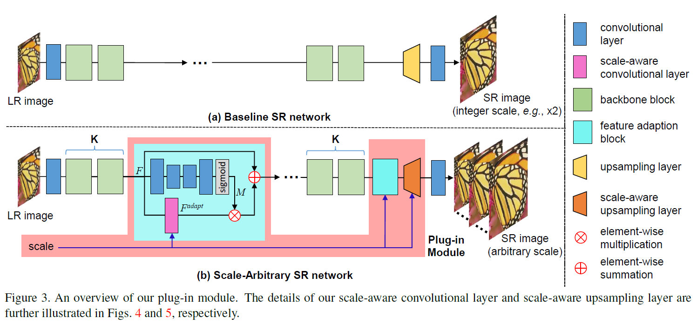
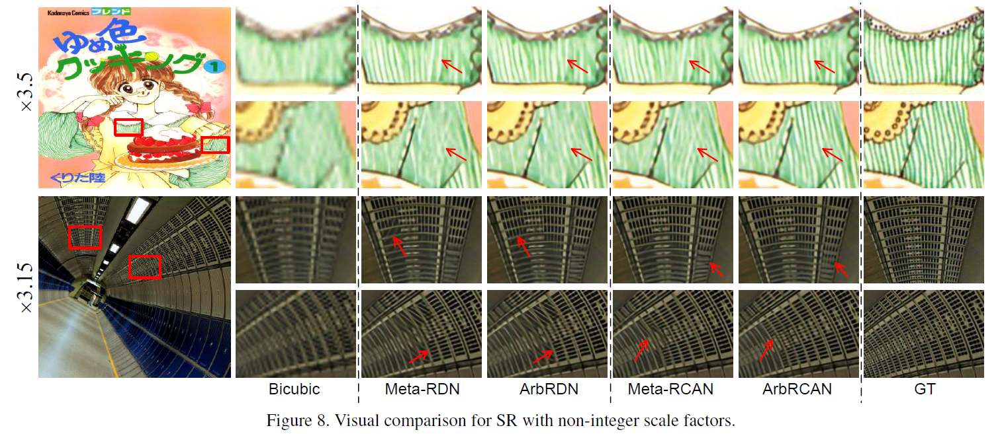
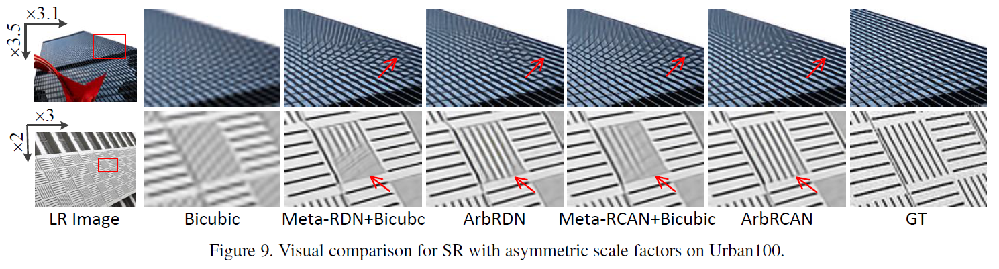

# Learning for Scale-Arbitrary Super-Resolution from Scale-Specific Networks
- A plug-in module to extend a baseline SR network (e.g., EDSR and RCAN) to a scale-arbitrary SR network with small additional computational and memory cost. 
- 70 epochs to train the extended network by using a scale-aware knowledge transfer paradigm to transfer knowledge from scale-specific networks.
- Promising results for scale-arbitrary SR (both non-integer and asymmetric scale factors) while maintaining the state-of-the-art performance for SR with integer scale factors.

## Overview

## Motivation
Although recent CNN-based single image SR networks (e.g., EDSR, RDN and RCAN) have achieved promising performance, they are developed for image SR with a single specific integer scale (e.g., x2, x3, x4). In real-world applications, non-integer SR (e.g., from 100x100 to 220x220) and asymmetric SR (e.g., from 100x100 to 220x420) are also necessary such that customers can zoom in an image arbitrarily for better view of details.

## Visual Results

## Demo

## Citation
